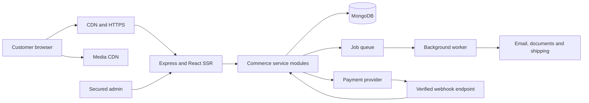

**AURELIO — Detailed ecommerce implementation plan**

Prepared: 21 September 2026. Status: planning only; development has not started.

**The proposed experience:** a digital metal atelier with the composure of an architectural publication, the product clarity of Apple's best product pages, and a distinctive motion language drawn from how metal is formed, finished, and illuminated. Aurelio should feel exceptional before anything moves, then become more expressive through interaction.

The ambition is an award-caliber storefront and a dependable international commerce operation. Original art direction and interaction design can make Aurelio recognizable; a claim that every effect is unprecedented, or that an award or conversion outcome is guaranteed, would not be credible. The specification below translates that ambition into buildable work and measurable release criteria.

Reading guide: Sections 3–12 cover the design and motion; Section 13 is the complete page/section checklist; Sections 14–25 describe the platform and operations; Sections 26–30 cover acceptance, delivery, effort, and discovery inputs. Sources appear next to the decisions they inform.

**1. Confirmed brief and planning assumptions**

| Item | Direction |
| --- | --- |
| Brand | Aurelio |
| Business | Metal handicraft manufacturing |
| Customers | Ecommerce is the main focus; bulk buyers receive a prominent enquiry flow |
| Markets | India and international customers at launch |
| Technology | Custom MongoDB, Express, React, and Node.js application; TypeScript throughout |
| Brand colors | `#f2f2f2` and `#072319` |
| Experience | Distinctive visual design, substantial animation and microinteractions, complete shopping/service pages, clean alignment, professional commerce UX |
| Performance | Fast initial rendering, responsive shopping interactions, stable layouts, measured animation performance |
| Current authorization | Research and implementation planning only |

This follows the latest scope clarification: the main experience is direct ecommerce, with an option to enquire for bulk. Full wholesale self-service accounts are a possible later expansion, rather than a launch requirement.

Unconfirmed inputs are product categories, catalog size, price positioning, ready-stock versus made-to-order split, export destinations, business registration country, existing gateway/carrier accounts, product assets, team, budget, and launch date. Indian business registration is a working assumption for the payment discussion, not a confirmed fact.

For sizing only, plan for approximately 100–500 product styles, potentially several thousand variants, one initial fulfillment origin, English content, and a configurable set of international destinations. These are architecture assumptions, not restrictions on Aurelio's eventual catalog. Categories such as sculptural objects, vases, candleholders, tableware, wall pieces, and lighting are examples to validate against the actual business.

International launch means completed buying and fulfillment flows for the agreed launch countries. It does not mean silently enabling every destination before shipping, payments, duties, and product eligibility are verified.

**2. Research conclusions and their application**

The following are design interpretations and engineering recommendations informed by primary sources. They are not claims that the reference websites use Aurelio's proposed stack or achieve its proposed performance targets.

| Reference | Useful lesson | Application to Aurelio |
| --- | --- | --- |
| [Apple AirPods product experience](https://www.apple.com/airpods-pro/) | Strong product hierarchy, large imagery, focused chapters, and an available buying route | Give each section one clear subject; keep shopping accessible throughout the brand story |
| [Apple motion guidelines](https://developer.apple.com/design/human-interface-guidelines/motion) | Motion should explain and respond; optional motion is part of good design | Tie effects to metal, product inspection, navigation, and state changes; provide a complete reduced-motion experience |
| [Awwwards ecommerce collection](https://www.awwwards.com/websites/e-commerce/) | A useful reference pool for art direction, typography, composition, and transitions | Build an annotated reference board, then develop an Aurelio-specific composition rather than reproducing a gallery example |
| [APPARATUS](https://apparatusstudio.com/) | Atmospheric product presentation and a clear connection between objects, materials, spaces, and design professionals | Use controlled lighting and an editorial materials story; give trade customers a prominent destination |
| [Commerce-UI's Tilly Sveaas case study](https://commerce-ui.com/work/tilly-sveaas-woocommerce-to-shopify-plus-migration-case-study) | Brand-specific motifs, product configuration, and merchant editing can coexist | Derive reusable components from Aurelio's own craft; make storytelling editable by the business team |
| [Baymard checkout research](https://baymard.com/research-articles/current-state-of-checkout-ux) | Guest checkout must be easy to find | Retail customers can purchase without creating an account; registration is offered after purchase |
| [Baymard product image research](https://baymard.com/research-articles/ux-product-image-categories) | Texture, context, and scale help communicate physical goods | Show finish macros, measured dimensions, styled use, and an understandable scale reference |
| [Google's Web Vitals guidance](https://web.dev/articles/vitals) | Loading, responsiveness, and stability require separate measurements | Set budgets for LCP, INP, and CLS, then monitor real mobile and desktop customers separately |

Apple and APPARATUS were also inspected visually in the browser. Other references were researched through their published pages and documentation; this was not a live performance audit of those sites. Agency case-study results are self-reported and are not forecasts for Aurelio.

**3. Creative concept: “The Art of Metal”**

The creative idea is to let customers experience the relationship between a maker's hand, a material's surface, and an object's silhouette. The store should evoke a beautifully photographed atelier and a contemporary design gallery.

The visual sequence moves between bright, quiet spaces for browsing and deep green spaces for selected stories. Real metal introduces warmth through photography: brass highlights, bronze shadows, silver edges, and dark patina. The interface itself remains disciplined around the two requested colors.

Three recurring motifs establish recognition:

- **The contour:** fine lines derived from the silhouette of an actual Aurelio product, used for section dividers and selected reveals.
- **The maker's mark:** a custom Aurelio monogram or stamp used sparingly in packaging stories, confirmations, and provenance details.
- **The light pass:** a controlled highlight moving over photographed metal, used as a recognizable visual gesture.

The emotional progression is: attraction → understanding of the craft → confidence in the product → confidence in Aurelio's ability to deliver → purchase or bulk enquiry.

Early design work will explore three compositions within this same concept: a light gallery treatment, a dark atelier treatment, and a more architectural editorial treatment. One will become the master direction after review using real products. This is a focused art-direction exercise, not three separate websites.

Design review will assess distinctiveness, product visibility, readability, alignment, interaction clarity, mobile quality, and how easily shoppers can purchase or enquire for bulk. An attractive hero alone will not qualify as a complete design.

**4. Visual system and layout specification**

**Color.** Use `#f2f2f2` for primary surfaces, `#072319` for text and primary actions, and the inverse pairing for selected story sections. About 70–80% of ordinary shopping surfaces should remain light. Dark story sections provide contrast without turning every page into a presentation.

The two solid brand colors have a calculated contrast ratio of approximately **14.85:1** under the WCAG relative-luminance formula. This does not automatically validate opacity-based secondary text, photographs, disabled states, borders, or every hover treatment; those require separate checks.

Supporting neutrals should be derived from the palette. Product photography can contain its natural colors. Restrained semantic colors may be introduced for errors and warnings, accompanied by text and icons. Do not turn gold into an additional dominant interface theme simply because the products are metal.

**Typography.** Prototype a refined display face such as [Canela](https://commercialtype.com/catalog/canela) with a clear UI family such as [Manrope](https://fonts.google.com/specimen/Manrope). Final selection depends on wordmark fit, numeral quality, currency glyphs, mobile rendering, font payload, and approved web licensing. Start with at most two families and the fewest necessary weights; a custom wordmark provides more identity than a third font.

| Element | Desktop starting range | Mobile starting range | Guidance |
| --- | --- | --- | --- |
| Hero display | 88–136 px | 44–64 px | Fluid scale; manually art-directed line breaks at key widths |
| Section heading | 48–72 px | 30–42 px | Short phrases; keep display typography away from dense forms |
| Product title | 32–44 px | 26–32 px | Accommodate long names and selected variants |
| Body copy | 17–19 px | 16–18 px | Comfortable line height around 1.5–1.65 |
| UI labels/prices | 14–16 px | 14–16 px | Clear numerals; prices must remain prominent |
| Small captions | 12–14 px | 12–14 px | Never the sole location of important purchase information |

**Grid.** Use a twelve-column desktop grid, eight-column tablet grid, and four-column mobile grid. Standard desktop content max-width starts around 1,440 px, with exceptional imagery allowed to bleed wider. Gutters begin at 24–32 px on desktop and 12–16 px on mobile; outer margins begin at 20 px on mobile and grow fluidly. Tune values with real catalog photography.

Use a spacing scale of 4, 8, 12, 16, 24, 32, 48, 64, 96, and 128 px. Typical section spacing is 96–144 px on desktop and 48–72 px on phones. Keep product cards on consistent baselines and equal image canvases even when editorial sections use deliberate asymmetry.

**Surfaces and components.** Favor flat surfaces, fine dividers, subtle depth, and small 2–6 px corner radii. Product cutouts should retain believable contact shadows. Use a limited custom icon family with consistent stroke weights, optical sizes, and generous hit areas. All button sizes, input states, badges, chips, drawers, tables, dialogs, empty states, and error states belong in the design system.

**Alignment rules.** Header content, section titles, grid edges, product details, and footer columns share container anchors. Text overlays get tested against the actual image crop. No item may rely on arbitrary absolute positioning to remain aligned across screen sizes.

**5. Photography, film, and content production**

Product assets are a critical dependency of the design. Animation cannot compensate for flat lighting, inconsistent finish colors, missing scale information, or poorly cut-out products.

For each sellable product family, plan these assets:

- A clean primary product image with a consistent camera angle and background.
- Alternate angles showing the back, underside, construction, or mounting where relevant.
- At least one texture/finish macro and a photograph of each materially different finish.
- A scale image in a hand, beside a familiar object, or within a measured room composition.
- A dimensions diagram, including usable dimensions where they differ from external size.
- A styled image showing the product in a believable space.
- Packaging and included-accessory imagery where it resolves purchasing questions.

Aim for 6–8 useful images per product family where justified, without manufacturing redundant galleries for simple products. Hero products receive additional lighting passes and a short turntable or process film. Budget a separate crop for phones; shrinking a wide composition is rarely sufficient.

The opening campaign needs one strong hero object, three to five collection images, a workshop photography set, authentic maker/process details, a small number of short films, and product data ready for the selected catalog. All craft claims, materials, origin descriptions, capacity figures, certifications, and customer testimonials must be supplied or verified by Aurelio.

Photograph matching lighting passes from a locked camera if the signature reflection effect is chosen. For interactive 3D, produce a dimensionally correct model and physically based materials from approved references. AI-generated imagery may support internal mood exploration; it must not invent the appearance, finish, scale, or manufacturing provenance of goods for sale.

Maintain an asset register containing SKU associations, rights, model releases where applicable, source file, crop/focal point, alt text, intended page, and derivative sizes. Keep source masters separate from web delivery assets.

**6. Information architecture and navigation**

Shopping and bulk enquiries share Aurelio's brand, product master data, and content library. Shopping is the primary journey. Bulk buyers can build an enquiry using the same products without navigating a separate wholesale storefront.

Recommended primary navigation: **Shop · Collections · Our Craft · Bulk Orders · Journal**, with persistent Search, Market/Currency, Account, and Cart utilities. Bespoke becomes a top-level link only if it is a real service. On mobile, Shop and Bulk Orders remain visible entry points within the first menu view. Bulk enquiries do not require registration.

| Area | Main pages and routes, before market prefix |
| --- | --- |
| Brand | `/`, `/our-craft`, `/materials`, `/materials/:slug`, `/about` |
| Retail | `/shop`, `/categories/:slug`, `/collections/:slug`, `/products/:slug`, `/search`, `/wishlist` |
| Buying | `/cart`, `/checkout`, `/order-confirmation/:reference` |
| Customer service | `/account`, `/account/orders`, `/track-order`, `/care`, `/shipping`, `/returns`, `/contact`, `/faq` |
| Bulk enquiries | `/bulk-orders`, `/bulk-orders/enquiry`, `/bulk-orders/confirmation` |
| Bespoke | `/bespoke`, `/bespoke/request`, project examples where available |
| Editorial | `/journal`, `/journal/:slug`, `/projects`, `/projects/:slug` |
| Legal | Privacy, terms of sale, bulk quotation terms where relevant, cookie preferences, applicable business disclosures |
| Internal | Separately secured administration application |

Market-aware URLs may use `/in/en/`, `/us/en/`, or other approved country/language combinations. Actual international destinations are decided during discovery. Navigation and every important product link must work as standard links, including opening in a new tab.

Search should understand product names, category, material, finish, SKU, and selected synonyms. Bulk buyers can also use exact SKUs. Filters should match the real range: material, finish, dimensions, category, price, availability, lead time, and suitability. Avoid filters that are empty or irrelevant to the current category. Section 13 expands this overview into the complete launch page and section checklist.

**7. Homepage storyboard**

The homepage needs an immediately usable first viewport. Customers must be able to start shopping without waiting for a film or introduction to finish; the bulk enquiry route remains easy to find.

| Chapter | Content and composition | Motion | Commercial purpose |
| --- | --- | --- | --- |
| 1. Opening object | Sculptural hero product, short Aurelio statement, prominent “Shop the collection” action; secondary craft link | One controlled reflection pass over a fully visible image; restrained title entry | Establish the brand and start the shopping journey |
| 2. Collection index | Three to five precise image-led categories | Subtle cropped-image reveal and underline response | Reach the right products quickly |
| 3. Selected objects | Four to eight products with clear titles, prices, and finish options | Very short stagger on entry; functional card hovers | Make the homepage shoppable early |
| 4. From metal to object | A documented Aurelio process, presented in three or four chapters | One desktop scroll-linked composition; a vertical narrative on mobile | Explain quality and manufacturing expertise |
| 5. Material library | Approved materials/finishes with macro photography | Selectable lighting or finish comparison | Help customers understand the surface they are buying |
| 6. Objects in space | Architectural scenes or customer projects with product links | Small hotspots with explicit open/close controls | Show scale and styling possibilities |
| 7. Bulk and project orders | Wholesale quantities, hospitality, retail partners, and relevant customization | A composed image transition, concise capability summary | Let larger buyers enquire without interrupting retail shopping |
| 8. Proof and service | Verified reviews/projects, packaging, delivery, care, and support | Mostly static; small feedback interactions | Address hesitation without visual noise |
| 9. Journal and footer | Two or three useful stories, contact routes, market selection, policies | A quiet final visual detail | Encourage deeper exploration and establish trust |

On a representative desktop layout, products should appear within roughly the first two screens. Mobile visitors encounter a clear shopping action and an accessible bulk link before optional storytelling. Avoid turning the homepage into a long sequence that hides the catalog behind repeated pinned sections.

Sample tonal direction for copy: “Objects shaped by hand. Made to hold a place.” This is working creative copy, subject to the real product story and brand review.

**8. Retail shopping and product detail experience**

**Collection pages.** Lead with useful product results, concise category copy, sorting, and a clear result count. Begin with a three- or four-column desktop grid and a two-column mobile grid where readable. Larger products or long names may need a different composition. Insert an occasional editorial tile without disrupting card order or keyboard navigation.

Filters are shareable through URL parameters; browser Back restores filters, pagination, and scroll position. Desktop filters may use a side panel; mobile uses an accessible sheet with selected count, clear-all, and an explicit Apply action if queries are costly. Provide crawlable pagination beneath any progressive “Load more” enhancement.

**Product cards.** Show the real product name, market price and currency, available finishes, stock/made-to-order status, and a clear product link. Alternate images load on deliberate interaction or near-viewport intent rather than downloading the whole catalog. Quick add is appropriate only for products whose required configuration is already unambiguous.

**Product detail pages.** On desktop, start around 58–62% gallery and 38–42% buying panel. Use large imagery, clear thumbnails, and on-demand zoom. The buying panel contains title, price, finish, size, quantity, stock/production lead time, delivery information, and a strong purchase action. Add an explicit bulk enquiry path close to the commercial information.

On mobile, place the title and price close to the opening image, keep variant choices easy to reach, and use a compact sticky buying action only after its full version leaves view. It must never conceal focused inputs or error messages.

Below the purchase area, provide the product story, material and finish details, metric/imperial dimensions, weight, care, intended use, mounting/inclusions, packaging, delivery/returns, verified reviews when available, and compatible or related products. Explain natural handmade variations with real examples. Food-contact, outdoor, heat, electrical, or load-bearing suitability must only be stated when supported.

Each variant has a real SKU, price, imagery, availability, and valid option combination. Changing a variant updates the selected image and availability without moving the buying controls. A finish effect must not imply that an unavailable finish can be ordered.

**Cart.** Offer an accessible drawer for quick confirmation and a full cart page for review. Show line-item configuration, estimated shipping where possible, lead times, currency, discounts, and clear mixed-lead-time handling. Provide remove/undo, quantity limits, price-change notices, and preserved state after errors. A visible cart item is not an inventory reservation.

**Checkout.** Use a clear sequence: contact/address → delivery and duties → payment → review/confirmation, combining steps only if usability testing supports it. Keep guest checkout prominent. Support address autofill, country-specific fields, flexible names, international phone input, clear inline validation, and an editable order summary. Preserve entered values on recoverable failures.

Costs, tax treatment, shipping estimates, and import-duty responsibility must be explained before payment. Payment cancellation, delayed confirmation, unsupported destinations, failed authentication, expired quotes, and interrupted network connections all need designed states. Confirmation shows a verified order state, delivery/production expectations, support, and optional account creation.

**9. Bulk enquiry and optional bespoke experience**

Bulk ordering launches as a polished request-for-quotation flow. It must capture an actionable brief and help Aurelio respond; it does not require building a separate B2B commerce platform.

**Entry points.** Provide Bulk Orders in navigation and the footer, “Enquire for bulk” beside the buying information on every eligible product, and “Request a bulk quote for these items” in the cart. The enquiry preserves selected SKUs, finishes, sizes, and quantities. It does not empty the retail cart or change its prices.

**Bulk landing page.** Explain suitable buyers, eligible product ranges, real minimum quantities, sample availability, customization boundaries, packaging options, export coverage, indicative lead times, and the enquiry-to-order process. Show genuine project work and manufacturing proof where available. End with a short FAQ and the enquiry form. Do not invent minimums or production capacity.

**Enquiry form.** Collect name, email, company if applicable, country and delivery location, product selection or desired category, quantities, finish/customization needs, desired delivery date, and notes. Phone is optional unless operationally necessary. Reference uploads and budget range can be optional. A multi-product enquiry basket supports buyers selecting several objects. Provide validation, upload limits, anti-spam protection, an acknowledgement, and a reference number.

**Internal workflow.** New → assigned → clarification needed → quote sent → follow-up → won, lost, or closed. Store contact information, requested products, files, market, notes, owner, timestamps, and communication history in the admin dashboard. Use a visible response-time commitment only after Aurelio defines one.

**Quotes.** Admin can create a versioned quotation recording product lines, currency, price, delivery estimate, freight, tax/duty assumptions, validity date, and payment terms. A customer can receive a secure quotation/payment route. An accepted quotation becomes one draft order through an explicit staff action or a later validated acceptance flow; it must not generate duplicate orders. Manual bank payment requires finance confirmation.

**Bespoke.** If Aurelio offers custom manufacturing, add a dedicated page and a conditional brief for dimensions, materials, finish, quantity, deadline, and reference files. Route it to the same enquiry management system. A short manufacturer-led discussion is appropriate when specifications cannot be priced immediately.

**Later expansion.** Business accounts, negotiated price lists, self-service quantity breaks, company roles, purchase-order approvals, bulk CSV ordering, credit terms, and a production portal can be added when enquiry volume justifies them. Data boundaries should allow this expansion, but these features are not launch commitments under the updated brief.

**10. Signature animation concepts**

Create five signature experiences and a reusable library of small interactions. Their relationship to Aurelio's products provides originality. Final inclusion depends on the approved assets and measured performance of the prototype.

| Signature | What the visitor experiences | Proposed implementation | Assets and fallback |
| --- | --- | --- | --- |
| **Light across metal** | A narrow highlight appears to travel over the hero object's real surface | Two registered photographs or rendered lighting passes, blended using a masked overlay; GSAP controls timing, with pointer response only on suitable devices | Locked-camera assets; static hero on reduced motion, low capability, or failed enhancement |
| **From blank to object** | A short story moves from material to shaping, finishing, and the completed product | ScrollTrigger coordinates three or four composition states; SVG contour and image transforms carry the transition | Documented process images; ordinary vertical cards on mobile/reduced motion |
| **The finish library** | A product or sample is inspected under consistent lighting while the selected finish changes | Actual finish photography with short crossfades; optional lighting toggle for selected hero products | Registered finish images; immediate image replacement as fallback |
| **The measured object** | Dimension lines resolve around the product when the visitor opens “Dimensions” | SVG lines and labels tied to product data, animated once on explicit request | Accurate measurements; always-readable static diagram and text table |
| **The maker's mark** | A subtle Aurelio stamp appears when a meaningful action completes | Custom SVG transform/stroke treatment after a verified save, quote submission, or order confirmation | Approved wordmark/monogram; ordinary status text remains authoritative |

The hero photograph, heading, navigation, and calls to action remain visible while the first enhancement initializes. The hero never waits behind a loading percentage or requires a visitor to scrub through an introduction.

A limited interactive 3D object inspection can be explored during prototyping for one to three flagship products. It is an optional enhancement with a click-to-load viewer and a normal gallery beneath it. It is not a prerequisite for browsing or buying. If measured gains in product understanding do not justify the payload and production effort, photographic inspection remains the launch solution.

**11. Motion and microinteraction inventory**

These are planned behaviors, not instructions to animate every element simultaneously. Each component gets a purpose, a trigger, a motion budget, and an accessible static state.

| Surface | Proposed behavior | Tool/approach |
| --- | --- | --- |
| Wordmark | Short line or opacity reveal on first entry | CSS or small SVG timeline |
| Navigation links | Fine underline extends from the text edge | CSS transform |
| Header | Gentle surface change after leaving the hero | CSS classes + observed threshold |
| Mega menu | Panel and category images enter in a short sequence | CSS/GSAP; complete keyboard operation |
| Search panel | Responsive expansion; immediate focus in input | Accessible dialog + CSS |
| Search results | Brief result replacement with stable geometry | CSS opacity; cancel stale requests |
| Primary buttons | Surface fill and slight arrow translation | CSS; fixed button hit area |
| Button press | Small compression with immediate feedback | CSS transform |
| Editorial CTA | Very subtle magnetic visual treatment inside a fixed target | GSAP quick setters; fine pointer only |
| Product cards | Small image scale and alternate-angle crossfade | CSS; no moving text/prices |
| Collection imagery | Cropped reveal when approaching the viewport | IntersectionObserver/CSS or shared GSAP helper |
| Product groups | Tight stagger, with total sequence capped | GSAP batch or CSS delays |
| Story headings | Line-based reveal for selected short display headings | SplitText; preserve semantic text |
| Editorial rules | Fine divider appears as the section is reached | SVG/CSS scale |
| Finish swatches | Selection ring and coordinated image update | CSS + application state |
| Size options | Clear selected state and availability explanation | CSS; native control semantics |
| Gallery | Swipe/keyboard navigation with stable aspect ratio | Lightweight gallery component |
| Zoom | Smooth movement within an explicitly opened viewer | Pointer tracking; on-demand image |
| Dimensions | Line drawing followed by fixed readable labels | SVG + GSAP |
| Material comparison | Handle or buttons change the visible finish | Pointer + keyboard + tap alternatives |
| Filters | Selected chips respond and result state updates | CSS; URL-backed data state |
| Product reordering | Optional short FLIP movement on small visible grids | GSAP Flip; measured and interruptible |
| Wishlist | Icon fills with a concise saved/removed message | CSS/SVG; announced state |
| Add to cart | Button responds immediately; confirmed item appears in drawer | CSS/GSAP; server response governs success |
| Cart quantity | Line total changes without layout movement | Tabular numerals; brief highlight |
| Remove item | Short exit followed by explicit undo | CSS; stable focus recovery |
| Drawer | Panel moves a small distance with restrained backdrop fade | Accessible dialog primitive |
| Accordions | Short content expansion with clear state | CSS or measured local animation |
| Form focus | Label/border response with persistent readable label | CSS |
| Validation | Field message appears nearby; focus goes to actionable errors | CSS + screen-reader announcement |
| Quote basket | Added line becomes visible and count changes | Brief highlight; no flying-object dependency |
| Bulk quantity inputs | Clear quantity validation and minimum guidance where applicable | CSS; rules validated on server |
| Uploads | Real progress, success, rejected-file, and retry states | Native progress semantics |
| Enquiry submission | Verified reference number and next steps appear | Short local transition |
| Order timeline | Verified current stage receives a subtle emphasis | CSS; static completed stages |
| Page navigation | Optional short crossfade or shared product image transition | Progressive enhancement; direct navigation fallback |
| Toasts | Short entrance and exit with readable duration | Accessible status region |
| Lookbook hotspots | Small open/close response | CSS; large hit target |
| Footer | One restrained contour or monogram detail on entry | SVG/CSS; no continuous loop |

**Timing system.** Start with 100–180 ms for immediate feedback, 180–280 ms for utility transitions, 350–650 ms for editorial reveals, and around 700–1,100 ms for isolated signature sequences. Durations are design starting points, not reasons to delay an action. Purchasing transitions should finish quickly and remain interruptible.

Use consistent easing: mostly controlled ease-out curves, with stronger easing reserved for scene transitions. Keep ordinary translations around 8–24 px and card scaling around 1.01–1.03. Broad blur, chromatic effects, cursor trails, sound on hover, and floating objects across the whole store are outside the proposed direction.

**12. Animation engineering and accessibility**

Use CSS for simple feedback and GSAP for coordinated timelines. React remains responsible for state and structure; animation owns only the specific visual properties it needs. Avoid two libraries writing to the same element's transform.

Integrate scoped timelines through `useGSAP`, clean up on route changes, and wrap delayed/event-created GSAP work appropriately. This prevents duplicated triggers and abandoned animations during React lifecycle changes. [GSAP's React integration guidance](https://gsap.com/resources/React/)

Use `gsap.matchMedia()` for viewport, pointer capability, and reduced-motion branches. Create different mobile compositions rather than merely shrinking desktop pinning. Selected heading animations can use SplitText's responsive re-splitting; retain accessible names and avoid splitting interactive link content into inaccessible fragments. [GSAP matchMedia](https://gsap.com/docs/v3/GSAP/gsap.matchMedia()/), [SplitText documentation](https://gsap.com/docs/v3/Plugins/SplitText/)

Native document scrolling is the launch baseline. ScrollTrigger can coordinate reveals and limited scene pinning without replacing it. Refresh measurements after relevant image/font/layout changes, and reserve stable space around pinned scenes. One substantial pinned story on the homepage is the initial maximum; catalog, cart, checkout, and enquiry forms remain ordinary scroll flows. [ScrollTrigger documentation](https://gsap.com/docs/v3/Plugins/ScrollTrigger/)

Animate transform and opacity where possible. Masks, SVG drawing, shadows, and clip effects require profiling because their rendering cost depends on the implementation and browser. Apply temporary layer hints only where measured useful; promoting every element increases memory use. Stop decorative loops offscreen and in hidden tabs. [web.dev animation guidance](https://web.dev/articles/animations-guide)

All content starts as usable HTML. Enhancement failure must not leave sections transparent, translated out of view, or waiting for a trigger that never fires. Animate below-fold content only after the animation system has initialized safely; do not hide the main LCP image for an entrance effect.

Aim for WCAG 2.2 AA, with additional motion-sensitive design practices. Use semantic landmarks, visible focus, correct labels, accessible dialogs, meaningful errors, and keyboard access to all purchase/enquiry flows. Test the final composed components; accessible primitives alone do not establish compliance. [WCAG 2.2 quick reference](https://www.w3.org/WAI/WCAG22/quickref/), [Radix accessibility guidance](https://www.radix-ui.com/primitives/docs/overview/accessibility)

Set an internal target of at least 44 × 44 CSS px for primary touch controls. WCAG 2.2 AA's target-size criterion specifies 24 × 24 CSS px or qualifying exceptions; the larger internal target is deliberate. [W3C target-size guidance](https://www.w3.org/WAI/WCAG22/Understanding/target-size-minimum.html)

Respect `prefers-reduced-motion` and offer a persistent site motion setting. Reduced mode removes parallax, scrubbed scenes, magnetic movement, and animated route transitions, while preserving functional status feedback. Provide pause/stop controls for moving content where required. Interaction-triggered animation guidance is an additional AAA criterion, not an AA requirement being misrepresented. [W3C pause/stop/hide](https://www.w3.org/WAI/WCAG22/Understanding/pause-stop-hide.html), [W3C animation from interactions](https://www.w3.org/WAI/WCAG22/Understanding/animation-from-interactions.html)

Capability adaptation is progressive: start with the good static version, then enable more expensive features only when appropriate. Save-Data/network/device hints are optional signals because browser support varies. A small viewport does not prove a weak device, and a desktop does not guarantee a powerful GPU.

**13. Complete page and section checklist**

This is the launch coverage specification. A “page” can be a reusable template serving many products or categories; it does not imply a separate custom-coded layout for every URL. Utility screens use the same carefully designed component system.

Research supports both a crawlable category-to-product hierarchy and direct access to purchase-related help. Shipping and return information should have explicit footer links, even when also present on product pages. [Google ecommerce navigation guidance](https://developers.google.com/search/docs/specialty/ecommerce/help-google-understand-your-ecommerce-site-structure), [Baymard shipping and returns navigation research](https://baymard.com/research-articles/footer-needs-return-shipping-links)

**Shopping and conversion — required at launch.**

| Page/template | Required sections and behavior |
| --- | --- |
| Homepage | Header; hero; category/collection shortcuts; selected products; craft story; material detail; bulk enquiry feature; verified proof; service information; footer. Journal/project features appear when content exists |
| Shop all | Title; category shortcuts; product count; filters; sort; product grid; selected filter chips; pagination; helpful no-results recovery |
| Category page | Breadcrumbs; category name and concise introduction; subcategories where useful; relevant filters; products; short buying guidance; related categories |
| Collection page | Collection story/image; products; useful filters; related collections. Use a collection for a curated story, and categories for the stable product taxonomy |
| Product detail | Gallery; title; SKU where useful; price/currency; finish/size selectors; availability/lead time; quantity; add-to-cart; wishlist; bulk enquiry; delivery estimate; returns summary; story; specifications; dimensions; care; related items |
| Search results | Persistent query; suggested corrections; counts; filters/sort; product results; useful category/material suggestions; no-results help |
| Wishlist | Saved products; current prices/stock; selected variant where known; remove/move-to-cart; empty state; optional account sync |
| Cart | Items and selected options; quantity/remove/undo; subtotal; discounts if supported; shipping/duty guidance; lead times; clear checkout action; bulk enquiry action; empty/error states |
| Checkout | Guest contact; address; market validation; delivery options; taxes/duties; payment method; editable summary; policy links; error recovery; payment-pending state |
| Order confirmation | Verified order/payment state; reference; items; totals; delivery/production expectations; tracking/help; optional account creation |
| Bulk orders | Manufacturing suitability; product ranges; minimum/sample guidance; customization; process; export information; genuine proof; FAQ; enquiry action |
| Bulk enquiry | Product list; quantities; variant/specification details; contact/destination; optional company/deadline/files; validation; submit |
| Enquiry confirmation | Saved reference; summary; promised next step; response window if agreed; continue-shopping link |

**Accounts and after-sales — required flows at launch.**

| Page/screen | Required sections and behavior |
| --- | --- |
| Sign in / optional account creation | Email entry; verification flow; understandable privacy copy; guest-shopping continuation; clear errors |
| Verification and expired-link states | One-time verification; resend with rate limits; expired/used-link explanation; return to intended page |
| Account overview | Recent orders; saved addresses; profile; wishlist link; help; sign out |
| Order history | Date/reference; status; amount/currency; summary; pagination; empty state |
| Order detail | Ordered variants; immutable totals; payment/refund status; shipments; tracking; invoice; support and eligible cancellation/return actions |
| Address book | Add/edit/delete address; country-aware validation; default selection; no forced reuse of shipping address as billing |
| Profile and preferences | Name/contact; verified email change; marketing preferences; privacy request route; account deletion request with retained-record explanation |
| Track order | Secure guest lookup or emailed access link; shipment status; carrier link; multiple packages; delay/help states |
| Return / damage / cancellation request | Eligibility explanation; order verification; item/reason selection; optional evidence upload; submission; request status; support escalation |
| Review submission | Verified-order invitation; rating/text; clear moderation rules; success/error states. Public reviews appear only when authentic reviews exist |

An email verification method is the proposed customer login baseline. Password reset and password change screens are required if passwords are adopted instead; they should not be built as disconnected dead-end pages. Guest checkout and guest after-sales access remain available.

**Brand, support, and policy pages — required content, with sensible consolidation.**

| Page | Required sections |
| --- | --- |
| About Aurelio | Real business story; product philosophy; people/place where appropriate; manufacturing identity; contact path |
| Our craft | Actual process; tools/materials; quality checks; workshop imagery; handmade-variation explanation; related products |
| Materials and finishes | Material/finish index; finish appearance; care; patina/aging; indoor/outdoor or food-contact suitability only when verified; relevant products |
| Care guide | Material-specific cleaning; handling/storage; maintenance; actions to avoid; support contact; downloadable care sheet if useful |
| Contact and support | Legal business name; support email/phone where available; address; service hours/time zone; retail/bulk enquiry routing; support form; applicable grievance contact |
| Help / FAQ | Ordering; payments; shipping; customs; made-to-order timing; returns; damage; care; bulk enquiries; direct links to detailed policies |
| Shipping and delivery | Supported countries; dispatch versus transit time; ready-stock/made-to-order rules; charges; tracking; packaging; remote areas; delivery exceptions; lost/damaged shipment process |
| International delivery and duties | Supported markets; charge currency; customs/duty responsibility; potential customs delays; required buyer information; unsupported-destination route. Can be a clearly linked section of Shipping if concise |
| Returns, refunds, and cancellations | Eligibility; time windows; condition; request process; return costs; refund method/timing; damaged/wrong items; approved made-to-order exceptions; market-specific rights |
| Privacy notice | What is collected; purpose; relevant recipients; retention; user rights/requests; international processing details; responsible contact |
| Terms of sale / website terms | Seller identity; ordering/payment; pricing/currency; availability; delivery; applicable cancellation/returns; service terms and dispute/contact route |
| Cookie information and preferences | Actual cookies/services; essential versus optional purposes; consent controls where required; later withdrawal/change |
| Accessibility information | Accessibility approach; contact for problems; assistance route; honest known limitations if any |

Shipping and returns receive separate footer links. Contact information is reachable without signing in. Legal content must reflect the actual selling entity, goods, and launch jurisdictions. For an Indian operation, review the current ecommerce rules and amendments, required business/grievance disclosures, and relevant product-label/tax requirements before publication. These are content and operational review tasks; this plan does not invent a policy or certify legal compliance. [Department of Consumer Affairs rules index](https://consumeraffairs.gov.in/pages/consumer-protection-acts)

**Conditional pages — build only when supported by the business.**

| Page | When needed and what it contains |
| --- | --- |
| Bespoke/custom manufacturing | If offered: capabilities, constraints, process, examples, indicative lead times, and a structured brief |
| Made-to-order guide | If important to the catalog: production sequence, estimates, changes/cancellation rules, and delivery expectations |
| Journal and article | If there is a publishing owner: material/care/styling stories, real photography, author/date, related products |
| Projects/lookbook | If real projects exist: imagery, project context, products/materials used, and bulk enquiry link |
| Gifts/gift wrapping | If supported: eligible products, message/packaging options, delivery rules; paid gift cards require a separate secure balance/refund design |
| New arrivals / best sellers | Curated collections; “best seller” labels use real sales data and a defined time period |
| Sale | Only when genuine promotions exist; clear pricing, dates, and eligibility |
| Store/showroom visit | Only for actual locations: address, opening hours, accessibility, appointment route |
| Size/installation guide | Where mounting, electrical installation, or larger dimensions require more guidance |
| Compare products | If users need it for functional dimensions/specifications; avoid adding complexity for purely aesthetic variants |

Careers, loyalty programs, subscriptions, marketplace seller pages, community forums, and full wholesale portals are not assumed launch necessities. Add them when a real business requirement exists.

**System states — design and implement, not just generic error text.**

Cover 404, server error, maintenance, offline/connection failure, payment cancelled/failed/pending, duplicate-submit recovery, expired verification, expired quote/payment link, out of stock, discontinued product, invalid option combination, empty cart, empty wishlist, no search results, unavailable shipping, changed price, changed delivery estimate, failed upload, session expiry, and unauthorized access. Every state needs an explanation and a useful next action. Private errors must not expose another customer's order or file.

**Global sections.** Define the announcement bar only for genuine service information; responsive header; breadcrumbs; market selector; search; wishlist; cart drawer; contextual service links; cookie preferences; accessible notices; and footer. The footer groups Shop, About/Craft, Customer Care, Bulk Orders, and Legal, followed by verified contact details and optional newsletter signup. Newsletter success and unsubscribe/preferences pages are needed only if that feature launches.

**14. Recommended MERN architecture**

MERN provides full control over the storefront and business logic. Its choice does not itself determine visual quality; the asset production, art direction, component quality, and iteration described above do that work.

Use a **modular monolith** initially: one well-structured application codebase, an Express/Node web service, and a separate background worker. Separate modules by business responsibility without introducing a network of microservices.

| Layer | Recommendation | Why |
| --- | --- | --- |
| Storefront | React + TypeScript, React Router Framework Mode, Vite | Server rendering, route data loading, route splitting, and familiar React composition |
| Rendering | SSR for product/category routes; prerender stable editorial pages where useful | Useful HTML and product content arrive before animation code |
| Backend | Express on a supported Node.js LTS release | Explicit API, webhook, authentication, and integration control |
| Database | Managed MongoDB replica set, typed repository layer and schema validation | Flexible catalog/variant documents and transactional order workflows |
| Styling | Design tokens + CSS Modules/custom CSS | Precise visual control and predictable component styles |
| Motion | GSAP + ScrollTrigger + `@gsap/react`; selected plugins on demand | One coordinated motion system |
| UI primitives | Accessible headless primitives, custom Aurelio styling | Reliable dialog/focus mechanics without importing a generic visual theme |
| Forms | Typed schema validation and an accessible form layer | Shared field rules with authoritative server validation |
| Client state | Route loaders/actions for server data; small local store only where useful | Avoid duplicate sources of truth for cart, prices, and inventory |
| Media | Object storage/CDN; generated image variants; controlled video delivery | Keep product media out of the database and application server response path |
| Search | MongoDB Atlas Search, validated against actual catalog needs | SKU/name/material search, autocomplete, and relevant filtering |
| Jobs | Redis-backed queue and Node worker when needed | Durable email, media, document, reconciliation, and fulfillment work |
| Admin | Separate React application or separately split admin routes | Keep operational code out of customer downloads |

React Router documents SSR and prerendering support, including custom Express deployment templates. This remains a MongoDB/Express/React/Node architecture; SSR does not require changing to a different backend stack. Pin compatible stable releases during implementation rather than treating versions in this plan as permanent. [Rendering strategies](https://reactrouter.com/start/framework/rendering), [deployment guidance](https://reactrouter.com/start/framework/deploying)

Serve storefront and API under the same site origin where practical. SSR loaders call shared service functions directly rather than making redundant HTTP requests back to their own server. Browser-facing API endpoints use those same service functions. The worker uses the same domain rules for retryable operations.

Proposed repository boundaries: `apps/storefront`, `apps/admin`, `apps/server`, `apps/worker`, `packages/ui`, `packages/contracts`, `packages/domain`, and `packages/config`. These are a future structure only; no application scaffolding is part of this planning task.

**15. Rendering, data loading, and caching**

| Route type | Rendering/data approach | Cache policy |
| --- | --- | --- |
| Home/craft/editorial | SSR or prerendered published content | Public cache with explicit publish invalidation |
| Categories/collections | SSR with paginated product summaries | Short public caching keyed by market and normalized query |
| Product detail | SSR product/variant data; progressively enhanced gallery | Bounded public caching; invalidate price/product changes |
| Search | Server query with cancellable enhanced results | Short-lived cache for safe public queries; never cache customer data |
| Cart/checkout/account | Request-specific server data | Private, no shared CDN cache |
| Bulk enquiry | Public form shell with protected private submissions | No shared caching of entered details or files |
| Admin | Authenticated application | Private, no shared CDN cache |

Use explicit market URLs and currency/price-list identifiers to keep cached content correct. A cookie-varying market selector must not allow one market's prices to be served from another market's cached page. Customer-specific HTML, tokens, addresses, and negotiated quotations never enter the public cache.

Cache invalidation is a feature: product publish/update → invalidate affected PDP/listing/content entries and refresh search/feed data. Price and availability are revalidated authoritatively at cart/checkout. Display data may be briefly cached; a cached page must never authorize a charge or stock deduction.

Return meaningful 404/410/redirect responses for missing, discontinued, and moved content. Use canonical URLs for the chosen variant/indexing strategy. Prerendering is useful for stable pages but does not replace live validation of stock or prices.

**16. Data model and catalog rules**

| Collection/domain | Key contents |
| --- | --- |
| Products | Slug, title, description, categories, material, process, care, SEO, publication status, linked media, suitability claims |
| Variants | Product reference, unique SKU, finish/size/options, dimensions, weight, packaging dimensions, status, image associations |
| Categories/collections | Taxonomy or curated membership, ordering, introduction, image, SEO |
| Markets/price books | Eligible countries, currencies, tax display rules, region prices, validity/version, payment/shipping capabilities |
| Inventory | SKU/location, on-hand quantity, reserved quantity, adjustments, revision, availability policy |
| Reservations | Checkout/order reference, SKU quantities, expiry, state; explicit release/commit logic |
| Carts | Opaque guest/user reference, variants/quantities, market, version, expiry; quoted values are revalidated |
| Customers/sessions | Verified identity, addresses, preferences, consent records, securely managed sessions |
| Orders | Immutable purchased-item snapshots, addresses, currency, taxes, discounts, freight, delivery commitments, states |
| Payments/refunds | Provider IDs, attempts, authorized/captured amounts, currency, reconciliation status, refund records |
| Shipments/returns | Package items, carrier reference, tracking events, delivery status, return/RMA and inspection records |
| Enquiries/quotes | Contact, destination, product selection, specifications/files, assigned owner, status, quote versions and validity |
| Content/media | Approved editorial blocks, metadata, derivatives, alt text, rights, publication versions |
| Reviews | Product/order linkage, rating, text, verification and moderation status |
| Audit/webhook/outbox records | Who changed what, unique external event IDs, durable follow-up tasks |

Store monetary amounts in integer minor units with ISO currency codes and currency-specific exponents. Do not assume every currency has two decimals. Use decimal-safe arithmetic for percentage calculations and documented rounding; never sum floating-point browser prices to determine a payable amount.

Products and variants are distinct. “Bronze” can mean a base material, a finish, or a color label; the catalog must distinguish them. Store dimensions and weight in consistent base units and render locale-friendly units. Packaging measurements are separate because shipping depends on the packed object.

Ready-stock and made-to-order products have different availability rules. Manufacturing capacity/lead time must not be represented as unlimited stock. Track required production time, cutoff rules, and mixed-cart fulfillment policy. Snapshot the promised timing on the order.

Create indexes for unique SKUs/slugs, product publication/category access, market price lookup, customer order history, reservation expiry processing, enquiry status/owner, unique provider events, and idempotency keys. Verify queries using realistic data and execution plans. Avoid unbounded user-entered regular expressions for search.

MongoDB supports atomic single-document writes and transactions for coordinated changes across documents. Use short transactions for stock reservation and order/payment state changes; do not hold a transaction open during a network call to a gateway. [MongoDB atomicity and transactions](https://www.mongodb.com/docs/manual/core/write-operations-atomicity/)

**17. API and business-module plan**

Use versioned REST endpoints and a documented contract. Every mutation validates input, authorization, business rules, and expected current version. Return stable error codes plus readable user messages, with correlation IDs for support.

| Module | Representative operations |
| --- | --- |
| Catalog | List/filter products, load product/variant, load collections and materials |
| Search | Autocomplete, full results, exact SKU, public faceting |
| Cart | Create/retrieve, add/update/remove, merge guest cart, recalculate |
| Checkout | Validate market/address, calculate tax/shipping, prepare order, initialize payment, retrieve verified outcome |
| Customer | Start/verify login, manage session/profile/addresses, retrieve own orders |
| After-sales | Secure guest order access, tracking, eligible cancellation/return/damage request |
| Bulk | Save/submit enquiry, validate uploads, retrieve signed customer-facing quote if enabled |
| Admin | Catalog/content publishing, stock adjustment, order fulfillment/refund, enquiry assignment/quoting, reporting |
| Integrations | Provider-specific payment/shipping webhooks, idempotent job handlers, reconciliation |

Examples of route families are `/api/v1/products`, `/api/v1/cart`, `/api/v1/checkout`, `/api/v1/orders`, and `/api/v1/enquiries`. The route names are less important than shared, tested domain behavior. Public catalog responses must not include margins, internal notes, cost prices, or unpublished assets.

Autocomplete needs debouncing and cancellation of outdated requests; relevance must be tested with actual vocabulary. Atlas Search supports autocomplete and fuzzy matching, but the index and ranking still require catalog-specific tuning. [MongoDB autocomplete documentation](https://www.mongodb.com/docs/atlas/atlas-search/autocomplete/)

**18. Payments, inventory, and order correctness**

For a confirmed Indian selling entity, evaluate Razorpay first for domestic checkout and approved international methods. Verify supported countries, currencies, customer details, international activation, refund behavior, settlement reporting, and actual account eligibility before committing the integration. [Razorpay international payment documentation](https://razorpay.com/docs/payments/international-payments/)

Stripe is an alternative only if Aurelio has an eligible approved account/entity: its current documentation says new Indian accounts are invite-only and specifies export information for physical-goods payments. Do not plan around automatic access. Keep a provider adapter so eligibility can change the integration without rewriting the order domain. [Stripe India international payment documentation](https://docs.stripe.com/india-accept-international-payments)

**Proposed retail transaction sequence:**

1. Server validates selected variants, destination, quantities, current price book, shipping quote, discounts, and tax treatment.
2. Calculate the final total in the actual charge currency. Create a checkout/order attempt with an idempotency key and immutable pricing snapshot.
3. Atomically reserve available stock for a defined payment window, with a short reservation transaction. Enforce quantity limits; a cart alone does not reserve stock.
4. Create the provider payment/order using the server total. Persist the provider reference. External calls occur outside database transactions and have retry/recovery rules.
5. Collect payment details through the provider's hosted/embedded secure components. Aurelio does not store raw card data or CVV.
6. Verify browser-return data where applicable, but treat the return page as a request to check payment status. Confirm payment using authenticated provider evidence and reconciliation rules.
7. Process signed webhooks using the exact raw request body. Deduplicate provider events and make state transitions idempotent. Check amount, currency, merchant/provider identifiers, and order linkage.
8. On verified capture or the provider's equivalent final paid state, commit the order/inventory transition and a durable outbox event. Queue confirmation, invoice, and fulfillment work from that record.
9. Release abandoned/failed reservations through an explicit worker. Database TTL deletion alone must never be responsible for restoring stock.
10. Reconcile delayed payments and missed webhooks. If payment arrives after stock was released, re-check inventory; use an explicit exception/refund path if fulfillment is no longer possible.

These are proposed Aurelio controls. Gateway signature verification and duplicate delivery are documented provider concerns. [Razorpay webhook validation](https://razorpay.com/docs/webhooks/validate-test/), [Stripe webhook behavior](https://docs.stripe.com/webhooks), [Stripe idempotent requests](https://docs.stripe.com/api/idempotent_requests)

Keep payment, order, production, and shipment state separate. For example, payment may be captured while production is awaiting scheduling; a partially refunded order may still have one delivered item. Do not compress these into one ambiguous “status” string.

Refunds need line/amount validation, provider reconciliation, inventory disposition, customer communication, and an audit trail. Returned goods become sellable stock only after the appropriate inspection. Coupon rules, if launched, require server validation for dates, market, eligible items, usage limits, and stacking.

**19. India and international selling**

Create a market readiness matrix before opening checkout. For each destination, record eligible products, charge/display currencies, payment methods, shipping services, tax/duty treatment, delivery estimate, return route, and required buyer information. Begin with India and a commercially chosen set of international countries at launch; expand the configuration as operations become ready.

**Currency.** Propose INR plus currencies relevant to the chosen markets, potentially USD, GBP, and EUR. Use deliberate market price books or a documented server-side FX/pricing policy. Clearly distinguish estimated display conversion from actual charge currency if they differ. Freeze the charge amount/currency for a checkout attempt, and record the refund currency/amount consistently.

**Market selection.** Offer an explicit country/currency selector and a non-blocking suggestion when useful. Preserve the visitor's choice. Avoid forced IP/language redirects; customer location, billing country, and delivery country can differ. Locale-aware URLs and `hreflang` are added only for actual published variants. [Google international site guidance](https://developers.google.com/search/docs/specialty/international/managing-multi-regional-sites)

**Shipping.** Evaluate carriers against Aurelio's origin, product weight, packed dimensions, insurance needs, delivery countries, and return handling. A DHL Express integration is one documented option for rates, labels, serviceability, and tracking; a domestic carrier/aggregator can be selected separately. Freight-sized bulk orders can remain quotation-based. Carrier estimates are not delivery guarantees. [MyDHL API](https://developer.dhl.com/api-reference/dhl-express-mydhl-api)

**Duties.** Choose a clear policy by route. Where a validated landed-cost service and operational setup support seller-paid duties, show the included amount. Where buyers pay on arrival, explain that before payment. Do not label an order “duties included” based solely on an approximate FX conversion or generic percentage. Quote terms must specify responsibility and the named destination. [ICC Incoterms reference](https://library.iccwbo.org/clp/clp-incoterms.htm)

**Export/product data.** Gather the correct product classifications, country of origin, materials, declared value, commercial invoice fields, packaging information, and relevant registration documents. Confirm IEC and other applicable export requirements with the business's operations/accounting advisers; the DGFT publishes the IEC process. [DGFT IEC manual](https://content.dgft.gov.in/Website/IEC_Manual_V4.1.pdf)

Taxes and market-specific consumer/privacy requirements are implementation dependencies, not hardcoded guesses. Approve rules with qualified local advisers and use current official/provider references during integration. Confirm any product-specific requirements for tableware, lighting, coatings, or other regulated uses before listing those products for the affected market.

**20. Admin and content management**

The business must be able to operate Aurelio without asking a developer to edit product arrays or page markup.

| Area | Launch capabilities |
| --- | --- |
| Catalog | Product/variant editing, categories, dimensions/materials, media, SEO, draft/publish/archive, validated CSV import |
| Inventory | Stock adjustments with reason, availability, ready-stock/made-to-order lead times, low-stock view |
| Orders | Search/filter, payment state, fulfillment, labels/tracking, partial shipments where supported, notes, customer assistance |
| Returns/refunds | Requests, eligibility, inspection outcome, authorized refund, payment reconciliation |
| Bulk enquiries | Assignment, status, specifications, secure attachments, quote versions, follow-up reminders, won/lost outcome |
| Content | Homepage/collection sections, craft/material pages, FAQs, policies, journal/project content if launched |
| Markets | Enabled countries, price books, shipping capabilities, tax/duty display configuration |
| Promotions | Simple codes and eligible products if needed; avoid building an extensive promotion engine before requirements exist |
| Reviews | Verification, moderation with audit history, business response where supported |
| Reporting | Orders/revenue/refunds by currency/market; best products; stock; enquiries; operational failures |
| Permissions | Owner/admin, catalog editor, fulfillment, support, finance; role-appropriate access and audit trail |

Use a constrained block editor: approved hero, product grid, image/text, material feature, FAQ, project, and CTA blocks. Editors control content, order, crop, and approved motion preset. They cannot inject arbitrary scripts or set animation durations that undermine performance.

Require preview and validation before publication. Preserve content versions and product-history records where operationally important. Empty modules disappear cleanly rather than showing placeholder reviews, logos, or unfinished journal tiles.

**21. Asset pipeline and performance budgets**

Media upload → validate type/size → private source storage → background derivatives → reviewed metadata → publish versioned CDN URLs. Generate responsive widths, modern formats with fallbacks, and accurate width/height metadata. Store bulk reference files privately with scoped expiring access; product assets become public only after approval. [S3 upload documentation](https://docs.aws.amazon.com/AmazonS3/latest/userguide/PresignedUrlUploadObject.html), [Sharp output formats](https://sharp.pixelplumbing.com/api-output/)

The hero image must be discoverable in the initial HTML, appropriately prioritized, and never lazy-loaded. Use `srcset`/`sizes`, correct crops, and a stable aspect ratio. Load below-fold galleries lazily; fetch zoom originals on intent. Preload only assets that are actually critical. [Google LCP optimization guidance](https://web.dev/articles/optimize-lcp)

Videos start with attractive posters. Use short, silent, appropriately encoded files for decorative scenes, defer their download, pause offscreen playback, and provide user controls where needed. Avoid shipping hundreds of image-sequence frames on initial load. Video scrubbing is a prototype-dependent choice because decoding and seek behavior vary by device. [web.dev video performance](https://web.dev/learn/performance/video-performance)

These are **proposed acceptance targets**, to be validated in the prototype; they are not measurements of an existing Aurelio site.

| Metric/budget | Proposed target | Measurement context |
| --- | --- | --- |
| LCP | Internal target ≤2.0 s; release objective ≤2.5 s at p75 | Real visits, mobile/desktop separated; key market segments |
| INP | Internal target ≤150 ms; release objective ≤200 ms at p75 | Real interaction telemetry; scripted interaction traces before launch |
| CLS | Internal target ≤0.05; release objective ≤0.1 at p75 | Full page lifecycle including images, banners, fonts, and drawers |
| Initial first-party JS | Target ≤180 KiB Brotli; review above 220 KiB per main route | Transferred code needed for initial route, with documented bundle report |
| Optional motion chunk | Prefer ≤80 KiB compressed for a route's extra choreography | Separately loaded and measured; do not treat deferred bytes as free |
| Initial CSS | Target ≤45 KiB compressed | Main storefront route |
| Initial font payload | Target ≤100 KiB total | Required subsets/weights only; license permitting |
| Primary hero image | Target ≤250 KiB mobile, ≤450 KiB desktop | Visual QA decides acceptable encoding; no universal quality setting |
| Initial mobile page transfer | Aim ≤1 MiB for the homepage critical experience | Includes HTML, CSS, JS, fonts, and initially requested imagery |
| Animation responsiveness | Aim for sustained 60 fps on agreed representative devices | Profile frames and long tasks; simplify scenes that repeatedly miss budget |
| Backend catalog latency | Initial target p95 ≤300 ms, excluding internet transit | Warm application under agreed representative load |
| Lighthouse | Aim ≥95 performance on key storefront lab runs | Fixed documented profile; trend/regression check, not a customer SLA |

Google's “good” Core Web Vitals thresholds are LCP ≤2.5 s, INP ≤200 ms, and CLS ≤0.1, assessed at the 75th percentile. Field data is required to confirm those outcomes; Lighthouse cannot establish real-user INP and a new site has no established field history. [Web Vitals measurement guidance](https://web.dev/articles/vitals)

Keep critical pages light through route-level splitting, deferred GSAP plugins, small icon imports, font subsetting where licensed, image derivatives, CDN caching, indexed queries, and limited third-party scripts. Load gateway code only where needed for payment. Evaluate analytics, chat, reviews, and marketing embeds by their measured cost.

If optional WebGL is approved, permit one active scene, limit pixel ratio and texture sizes, load on demand, stop rendering offscreen, dispose resources, handle context loss, and provide an immediate gallery fallback. Geometry/texture transfer and decoded memory both need budgets. A fast network download can still create a slow GPU experience.

**22. Security, privacy, and operational controls**

Use secure, HTTP-only session cookies, appropriate SameSite behavior, CSRF protection for cookie-authenticated mutations, session rotation, and server-side ownership checks. Avoid placing long-lived authentication tokens in local storage. Customer sign-in codes/links need short validity, one-time use, rate limits, and responses that do not reveal whether an account exists. Admin access requires MFA and stronger session policies.

Validate inputs through explicit schemas; authorize individual orders, enquiries, files, refunds, and admin actions. Sanitize rich content, bound query complexity, restrict upload formats, and configure safe response headers and a tested Content Security Policy. Payment provider requirements must be included in the CSP deliberately. Use supported dependencies and a secrets manager; log correlation IDs without leaking credentials or sensitive personal data. [Express production security](https://expressjs.com/en/advanced/best-practice-security/), [OWASP session guidance](https://cheatsheetseries.owasp.org/cheatsheets/Session_Management_Cheat_Sheet.html)

Uploads get randomized storage keys, owner association, size/type checks, quarantine/scanning as appropriate, and authenticated download authorization. A signed storage URL is not a substitute for deciding whether a user is allowed to request it. Never expose all enquiry attachments through a public directory.

Track consent and marketing preferences separately from transaction communications. Collect only necessary data, define retention and deletion workflows, and identify records that must be retained for legitimate business/legal reasons. Analytics should not receive names, addresses, payment details, free-form enquiry text, or private upload contents.

Add role-based refund controls, audited stock adjustments, dependency monitoring, rate limits on login/enquiry/search abuse, and alerts for unusual payment failures. The objective is a store that can be operated safely by the business team without giving every staff member unrestricted permissions.

**23. SEO, discoverability, and editorial strategy**

Public products and collections receive useful server-rendered HTML, unique page titles, descriptions, canonical URLs, descriptive image alt text, crawlable links, and XML sitemaps. Provide Open Graph/social images for products, collections, and important stories.

Define the indexing policy before implementation: index meaningful categories and selected curated landing pages; control combinatorial filter/search URLs; give pagination real links; redirect renamed products; retain useful discontinued-product pages where appropriate. Do not automatically index every material/price/filter permutation. [Google ecommerce URL guidance](https://developers.google.com/search/docs/specialty/ecommerce/designing-a-url-structure-for-ecommerce-sites)

Implement accurate Product/Offer markup, ProductGroup/variant relationships where appropriate, BreadcrumbList, and Organization information. Structured prices, availability, shipping/return information, and public page content must agree. Add review aggregates only for authentic eligible review data. Validate representative pages with Google's testing tools before launch. [Product variant structured data](https://developers.google.com/search/docs/appearance/structured-data/product-variants), [Organization structured data](https://developers.google.com/search/docs/appearance/structured-data/organization)

International variants get correct language/region codes, reciprocal `hreflang`, self-canonicals where appropriate, and an `x-default` destination where useful. Do not invent a country code for a regional grouping or force visitors away from their selected market.

Noindex account, checkout, internal search as appropriate, private quote, and admin pages. Authentication still protects private information; robots rules and noindex directives are not security controls. Configure staging access restrictions so test products, checkout pages, and media do not become public search results.

Prepare Merchant Center/product feeds if selling channels require them, using the same authoritative prices, identifiers, stock, and market eligibility as the storefront. Update feeds after catalog changes and monitor rejected items.

Editorial launch topics should answer actual purchase questions: differences between materials/finishes, metal care, choosing dimensions, styling objects, natural patina, handmade variation, and how bulk enquiries work. Photograph and write these from Aurelio's real expertise. Do not fill the site with generic SEO articles that add little product understanding.

**24. Measurement and business feedback**

Define a privacy-conscious event dictionary before coding. Suggested events include product-list view, product selection, product view, variant selection, search/no results, filter use, add/remove cart, begin checkout, shipping selection, payment attempt, purchase, refund, bulk enquiry start/submit, and enquiry won/lost.

Purchase reporting is based on verified server order state and a unique transaction identifier, with client/server deduplication where both are used. Record currency and avoid adding unlike currencies into a single revenue number without a documented reporting conversion.

Measure shopping and enquiries separately:

- Retail: product-view-to-cart, cart-to-checkout, checkout completion, payment success, order value, refunds/returns, and revenue by market/device/channel.
- Bulk: enquiry completion, qualified enquiry rate, time to first response, quote turnaround, quote acceptance, and attributable won order value.
- Experience: field Web Vitals, search success/no-result terms, JavaScript/API errors, route-specific performance, and scene abandonment signals interpreted cautiously.
- Operations: low stock, oversell exceptions, shipment delays, failed webhook/job age, unreconciled payments, and support demand.

Set commercial improvement goals after a baseline exists. Avoid promising a conversion uplift from animation alone. Compare simpler and richer treatments with usability research and controlled experiments when traffic supports meaningful conclusions.

**25. Deployment, reliability, and maintenance**

Use isolated development, staging, and production environments, with separate credentials, databases, media, and payment modes. Staging should resemble production's rendering, caching, and security configuration.

Deploy the Express/SSR service in a managed Node/container environment, the worker as a separately supervised service, MongoDB in a nearby managed region, and media through a CDN. Choose the primary region after confirming the business origin and audience. International caching helps public content; it does not remove the latency of every personalized database request.

Infrastructure selection should compare operational simplicity, regional availability, database proximity, deployment rollback, observability, support, and total cost. Do not split the first release across numerous vendors without a clear need.

CI should run type/lint/build checks, targeted automated tests, critical end-to-end journeys, accessibility scans, and route bundle/performance checks. Preview deployments support design review before production. Use backward-compatible schema changes and migration records so application rollback remains possible.

Run durable background jobs for image processing, confirmation/invoice delivery, carrier work, reservation expiry, and payment reconciliation. Jobs require bounded retries, idempotent side effects, dead-letter handling, and an admin recovery view. A queue retry must not create a second shipment or send contradictory order messages. [BullMQ worker documentation](https://docs.bullmq.io/guide/workers)

Set up structured logs, error tracking, uptime checks, payment/webhook alerts, queue-lag alerts, and media/asset checks. Provide a feature flag that disables expensive motion or optional 3D without affecting checkout.

Backups need a tested restore procedure, not just an enabled setting. Propose recovery objectives of no more than 15 minutes of order-data loss and restoration within four hours, subject to the chosen paid database/hosting capabilities and a successful drill. Treat these as targets until verified. Document how to reconcile provider payments and orders after recovery.

Operational handover includes product publishing, order/refund handling, bulk enquiry response, account access, backup/restore, incident escalation, content updates, and dependency maintenance. Assign owners before launch.

**26. Testing and acceptance plan**

Test the real user journeys and business invariants. Visual snapshots alone cannot establish that payments, inventory, or international shipping work.

| Test group | Required coverage |
| --- | --- |
| Pricing/domain | Currency exponent and rounding; variant validity; quantities; discounts if used; price-book changes; shipping/tax total consistency |
| Inventory | Last-item race; multi-item reservation atomicity; expired reservations; cancelled checkout; late payment; manual stock adjustment conflicts |
| Payments | Success, failure, cancellation, delayed confirmation, duplicate/out-of-order webhooks, mismatched amount/currency, capture failure, partial/full refund |
| Retail journey | Browse/filter/search → choose variant → cart → guest checkout → paid order → tracking → eligible return request |
| International journey | Each launch market's currency, address format, payment method, product eligibility, shipping, duty disclosure, and return information |
| Bulk enquiry | Product prefill; multi-product quantities; validation; upload failure/retry; duplicate submit; assignment; quote version and draft-order conversion |
| Account/security | Login expiry, ownership enforcement, role restrictions, CSRF, protected uploads, rate limits, guest tracking protection |
| Content/admin | Draft/publish; preview; cache invalidation; rejected imports; image derivatives; missing data; rollback |
| Accessibility | Keyboard purchase/enquiry; focus order; dialogs; screen-reader labels/status; 200–400% zoom/reflow; reduced motion; touch alternatives |
| Visual | Real long names, all finishes, sale/out-of-stock states, multiple currencies, narrow devices, large screens, dark-section contrast |
| Resilience | Slow network, failed media, disabled animation, unavailable gateway/carrier, interrupted checkout, worker retry, restore rehearsal |

Use unit tests for pricing and state transitions, API integration tests against realistic database behavior, and Playwright for critical end-to-end journeys. Use accessibility automation plus manual VoiceOver/NVDA and keyboard checks. Capture visual regressions with animations set to deterministic states, then separately inspect real motion.

Test current major desktop browsers and representative recent mobile Safari/Chrome versions, plus at least one lower-powered Android device and one iPhone. Check widths around 360, 390, 768, 1,024, 1,440, and 1,920 px, including intermediate widths and landscape. Exact device/browser support is fixed at kickoff and revisited against audience data.

Representative concurrency test: with one available unit, many simultaneous checkout attempts must produce at most one valid stock reservation, and retrying a request must not duplicate the payable order. A failed payment is distinct from a failed browser redirect; both need tested outcomes.

Run load tests against an agreed traffic model and a sensible peak multiplier. Catalog size and expected campaign traffic are still unknown, so this plan does not claim an untested requests-per-second capacity.

**Release acceptance:**

- All required pages in Section 13 have complete approved content and usable mobile layouts.
- Retail purchase and bulk enquiry work from beginning to end on the agreed devices.
- Gateway/carrier integrations are verified for each enabled launch market.
- Prices, availability, taxes, shipping, and duty disclosures remain consistent across page, cart, checkout, order, and structured data.
- Duplicate payment events, last-item races, late payments, and refund flows pass meaningful tests.
- No unresolved critical security defect, broken ownership check, or blocking accessibility failure remains.
- Performance budgets have documented lab evidence; production field monitoring is installed for validation after traffic arrives.
- Motion-off and enhancement-failure modes leave the entire store usable.
- Catalog/content/stock updates work through admin; backups and recovery have been exercised.
- Support, fulfillment, refund, bulk-response, and incident owners can operate the system.

**27. Implementation sequence and deliverables**

The recommended delivery window is approximately **16–20 weeks** for the updated ecommerce-first scope with international launch, original art direction, prepared assets, two to three experienced engineers, a dedicated designer, and shared QA/content support. This is an initial planning estimate, not a fixed bid. A smaller team, a larger catalog, unavailable assets, or slow gateway approvals changes the schedule.

| Phase | Indicative timing | Work and concrete output | Exit condition |
| --- | --- | --- | --- |
| 0. Discovery and operational mapping | Weeks 1–2 | Product/catalog audit; customer tasks; market matrix; shipping/payment eligibility; content inventory; scope and success criteria | Real launch catalog/markets and responsibilities agreed |
| 1. Art direction and UX | Weeks 2–5 | Reference board; typography/color/grid; homepage/PDP/category/cart/checkout/bulk wireframes; high-fidelity desktop/mobile designs; motion storyboard | Complete visual direction works with real products and real content |
| 2. Foundations | Weeks 3–6 | MERN workspace; design tokens/components; SSR/Express setup; schemas; auth; CI/staging; media pipeline; initial admin | One real product renders correctly, quickly, and accessibly from database to page |
| 3. Retail core | Weeks 5–9 | Categories/search/filters; PDP/variants; wishlist; cart; customer/guest order flows | Browse-to-order path works with test data and test payment integration |
| 4. Payments, international, bulk, operations | Weeks 7–12 | Gateway webhooks; stock reservations; market prices; carrier/tax rules; enquiries/quotes; refunds; order admin; communications | End-to-end retail and enquiry workflows work for approved launch markets |
| 5. Signature motion and polish | Weeks 8–13 | Production hero/story/material effects; microinteraction library; mobile alternatives; performance profiling | Each signature earns its place against design and performance criteria |
| 6. Content completion and hardening | Weeks 12–16 | Real catalog; support/policies; SEO; analytics; usability sessions; accessibility/security/performance fixes | Release acceptance checklist passes |
| 7. Controlled launch | Weeks 16–18 | Production readiness review; limited release; real order verification; monitoring; staff handover | Business and technical operations work with live, authorized activity |
| Contingency | Through approximately week 20 | Asset delays, market-specific issues, integration approvals, unexpected QA | Agreed scope complete without hiding unfinished critical flows |

Photography and content production run alongside discovery/design. Payment eligibility and international shipping are validated early because they can alter checkout requirements. Motion prototyping begins in design; production choreography follows stable layout and loading behavior.

**First implementation milestone, when development is authorized:** a vertical slice containing one real product, the design system, a server-rendered product page, functional variant selection, cart, test-mode checkout, verified order creation, a bulk enquiry from that product, and one representative signature effect. This exposes the hardest design/performance/commerce issues before repeating the pattern across the store.

**28. Prioritized build backlog**

| Priority | Workstream | Minimum definition of done |
| --- | --- | --- |
| Launch-critical | Catalog and markets | Correct real SKUs, prices, eligibility, product content, and image associations |
| Launch-critical | Shopping pages | Home, taxonomy, search, PDP, cart, checkout, confirmation, and all recovery states usable on mobile |
| Launch-critical | Orders and stock | Authoritative pricing, reservations, payment verification, fulfillment, refunds, tracking, and operational admin |
| Launch-critical | Bulk enquiries | Product/cart entry, complete form, confirmation, secure files, internal ownership and status |
| Launch-critical | Service and trust | Contact, shipping, duties, returns, care, terms/privacy, business disclosures, and guest assistance |
| Launch-critical | Quality | Accessibility, security, SEO basics, analytics, backups, and measured performance |
| Brand-defining launch work | Visual and motion system | Approved art direction; exceptional real photography; five signature concepts resolved to viable implementations; reusable microinteractions |
| Launch if content exists | Editorial/project pages | Original useful content with an owner and no empty sections |
| Later enhancement | 3D/AR | Evidence that it helps inspection/scale; accurate assets; measured payload and device support |
| Later enhancement | Full B2B portal | Proven enquiry volume justifies negotiated pricing, business roles, quick order, credit terms, and repeat procurement |
| Later enhancement | Loyalty, gift cards, personalization | Clear commercial case and complete operational/security requirements |

Brand-defining work is part of the intended launch quality. “Later enhancement” is reserved for capabilities whose benefits are still unproven or whose business rules have not been requested.

**29. Effort, budget structure, and risk management**

An initial effort allowance for this scope is approximately **1,500–2,400 specialist hours** across design, engineering, QA, content integration, and release work, excluding a substantial photography/film production. This is an original planning estimate with broad uncertainty, not researched market pricing or a supplier quote.

Build cost should be calculated as agreed role-specific hours × agreed rates, plus asset production, licenses, and a 15–25% contingency appropriate to the unresolved scope. Quote photography per approved shot list, rather than treating it as an unlimited allowance. Re-estimate after the catalog and prototype are ready.

Recurring cost planning should include application/worker compute, managed database and backups, queue infrastructure, media storage/transformations/egress, transactional email, observability, domain, and ongoing maintenance. Gateway charges, carrier labels/freight, duties/taxes, and foreign-exchange costs are separate transaction/operational costs. Obtain current provider quotes for Aurelio's expected volumes before choosing paid plans.

GSAP currently advertises its library as free; confirm the applicable license at implementation. Paid typefaces, custom footage, stock/reference licenses, and 3D assets still need their own budget. [GSAP pricing](https://gsap.com/pricing/)

| Risk | Practical response |
| --- | --- |
| Real imagery arrives late | Approve the shot list in discovery; use a representative product early; track asset readiness per launch SKU |
| Too many effects reduce speed or comprehension | Prototype representative scenes; set route budgets; simplify failing scenes; keep shopping controls immediate |
| International gateway approval is delayed | Validate eligibility first; keep provider-specific code behind an adapter; do not open unsupported payment methods |
| Heavy/fragile products create unexpected freight costs | Record packed dimensions/weight; test representative destinations; separate freight enquiries from normal parcel checkout |
| Bulk/custom orders have undefined rules | Capture them as enquiries; approve quotes explicitly; defer automated wholesale pricing until rules are stable |
| Pricing/stock race or duplicated events | Idempotent mutations, transactional reservations, unique event records, reconciliation, and focused concurrency tests |
| Custom CMS becomes hard to maintain | Limit it to approved content blocks and operational workflows; document ownership and routine updates |
| Store looks good only on the designer's monitor | Review real phones, intermediate widths, long names, all currencies, reduced motion, and slower devices throughout |
| “All pages” becomes uncontrolled expansion | Use the required/conditional inventory and require a real customer or operational purpose for each extra page |

**30. Information needed before implementation**

The plan can be reviewed now. These details should be gathered during discovery when development is requested:

1. Actual product categories, SKU/variant count, top products, and representative retail price ranges.
2. Existing logo, brand assets, available photography/film, and permission to produce missing assets.
3. Ready-stock versus made-to-order rules, lead times, quantity limits, customization, and sample/bulk policies.
4. Legal selling entity, warehouse/origin, target international countries, and existing payment/shipping accounts.
5. Packaging dimensions/weights, delivery services, return handling, damage claims, tax/export documentation, and support contacts.
6. Confirmed business policies: refunds, cancellations, warranties where offered, and bulk quotation/payment terms.
7. Marketing/content ownership, desired analytics, domain, team availability, budget range, and intended launch window.

Until these are confirmed, the plan labels examples and estimates explicitly. No fictitious product range, manufacturing certification, customer count, delivery promise, or international coverage should appear in the eventual store.

**31. Research register and use of evidence**

Research was conducted on 21 September 2026. The links beside relevant decisions are the primary evidence trail. Reference sites inform visual interpretation; official technical documentation establishes capabilities and constraints; Baymard supplies directly published ecommerce usability research. Proposed Aurelio layouts, timings, budgets, workflows, and estimates are design/engineering judgments.

| Research area | Primary references and resulting decision |
| --- | --- |
| Product storytelling | [Apple](https://www.apple.com/airpods-pro/), [APPARATUS](https://apparatusstudio.com/), [Awwwards ecommerce](https://www.awwwards.com/websites/e-commerce/): product-led composition and selected expressive moments |
| Brand-specific commerce | [Commerce-UI case study](https://commerce-ui.com/work/tilly-sveaas-woocommerce-to-shopify-plus-migration-case-study): distinctive motifs plus merchant-operable content |
| Complete retail UX | [Baymard checkout](https://baymard.com/research-articles/current-state-of-checkout-ux), [product images](https://baymard.com/research-articles/ux-product-image-categories), [shipping/returns links](https://baymard.com/research-articles/footer-needs-return-shipping-links): guest buying, scale/texture evidence, findable service information |
| Rendering and animation | [React Router](https://reactrouter.com/start/framework/rendering), [GSAP React](https://gsap.com/resources/React/), [ScrollTrigger](https://gsap.com/docs/v3/Plugins/ScrollTrigger/): SSR storefront with scoped progressive motion |
| Performance | [Web Vitals](https://web.dev/articles/vitals), [LCP](https://web.dev/articles/optimize-lcp), [animation performance](https://web.dev/articles/animations-guide): measurable page and animation budgets |
| Accessibility | [WCAG 2.2](https://www.w3.org/WAI/WCAG22/quickref/), [motion guidance](https://www.w3.org/WAI/WCAG22/Understanding/animation-from-interactions.html): complete keyboard, touch, screen-reader, and reduced-motion flows |
| Data and payments | [MongoDB](https://www.mongodb.com/docs/manual/core/write-operations-atomicity/), [Razorpay](https://razorpay.com/docs/payments/international-payments/), [Stripe India](https://docs.stripe.com/india-accept-international-payments): transaction integrity and early eligibility checks |
| International operations | [DHL](https://developer.dhl.com/api-reference/dhl-express-mydhl-api), [ICC](https://library.iccwbo.org/clp/clp-incoterms.htm), [DGFT](https://content.dgft.gov.in/Website/IEC_Manual_V4.1.pdf): market readiness, shipping data, clear duty responsibilities |
| Discoverability | [Google ecommerce navigation](https://developers.google.com/search/docs/specialty/ecommerce/help-google-understand-your-ecommerce-site-structure), [product variants](https://developers.google.com/search/docs/appearance/structured-data/product-variants): crawlable catalog and truthful structured data |

Re-check provider availability, software compatibility, licenses, shipping services, and jurisdiction-specific requirements at implementation and before launch. The plan is complete as a planning artifact; application development begins only when requested.
